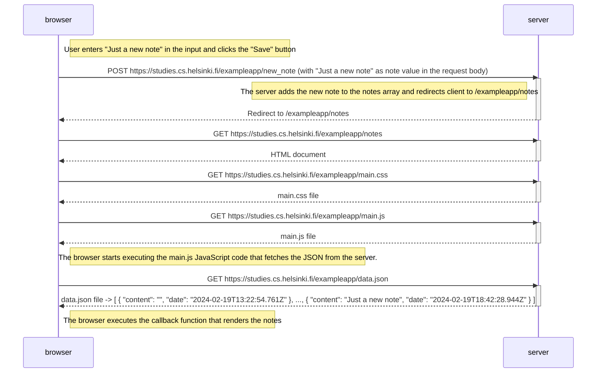

```mermaid
sequenceDiagram
    participant browser
    participant server

    Note right of browser: User enters "Just a new note" in the input and clicks the "Save" button

    browser->>server: POST https://studies.cs.helsinki.fi/exampleapp/new_note (with "Just a new note" as note value in the request body)
    activate server

    Note left of server: The server adds the new note to the notes array and redirects client to /exampleapp/notes

    server-->>browser: Redirect to /exampleapp/notes
    deactivate server

    browser->>server: GET https://studies.cs.helsinki.fi/exampleapp/notes
    activate server
    server-->>browser: HTML document
    deactivate server

    browser->>server: GET https://studies.cs.helsinki.fi/exampleapp/main.css
    activate server
    server-->>browser: main.css file
    deactivate server

    browser->>server: GET https://studies.cs.helsinki.fi/exampleapp/main.js
    activate server
    server-->>browser: main.js file
    deactivate server

    Note right of browser: The browser starts executing the main.js JavaScript code that fetches the JSON from the server.

    browser->>server: GET https://studies.cs.helsinki.fi/exampleapp/data.json
    activate server
    server-->>browser: data.json file -> [ { "content": "", "date": "2024-02-19T13:22:54.761Z" }, ..., { "content": "Just a new note", "date": "2024-02-19T18:42:28.944Z" } ]
    deactivate server

    Note right of browser: The browser executes the callback function that renders the notes
```
