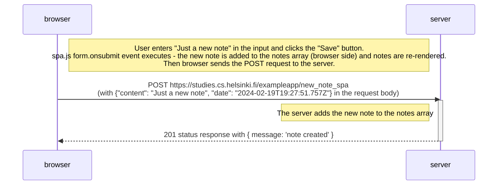

```mermaid
sequenceDiagram
    participant browser
    participant server

    Note right of browser: User enters "Just a new note" in the input and clicks the "Save" button. <br/>spa.js form.onsubmit event executes - the new note is added to the notes array  (browser side) and notes are re-rendered. <br/> Then browser sends the POST request to the server.

    browser->>server: POST https://studies.cs.helsinki.fi/exampleapp/new_note_spa <br/>(with {"content": "Just a new note", "date": "2024-02-19T19:27:51.757Z"} in the request body)
    activate server

    Note left of server: The server adds the new note to the notes array

    server-->>browser: 201 status response with { message: 'note created' }
    deactivate server
```
